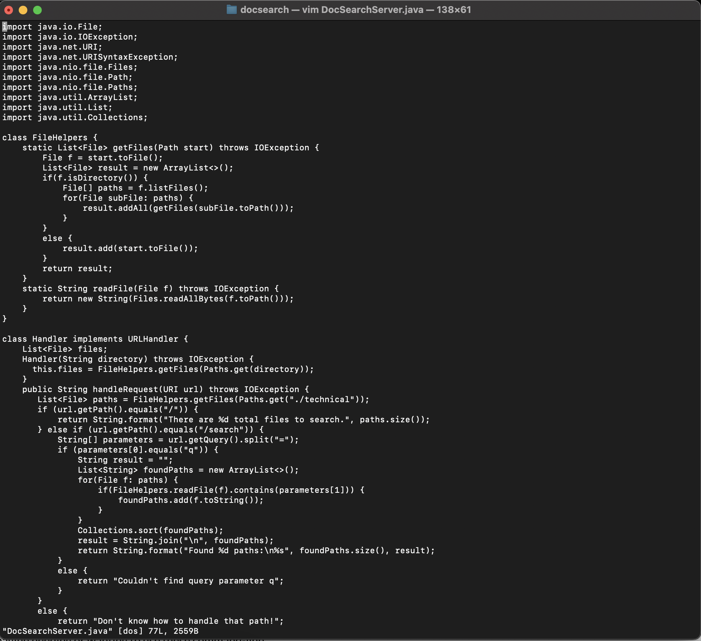
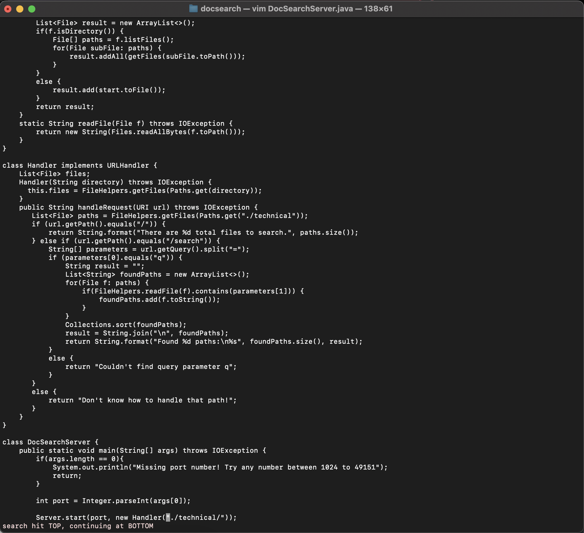
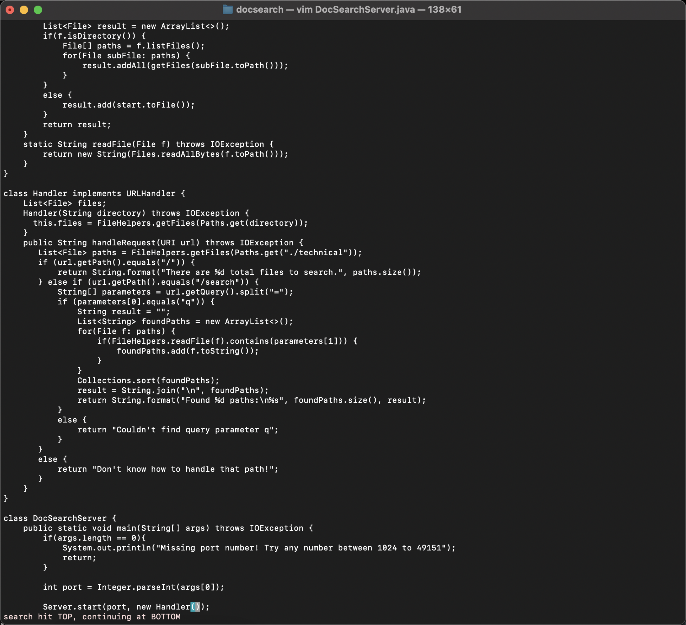
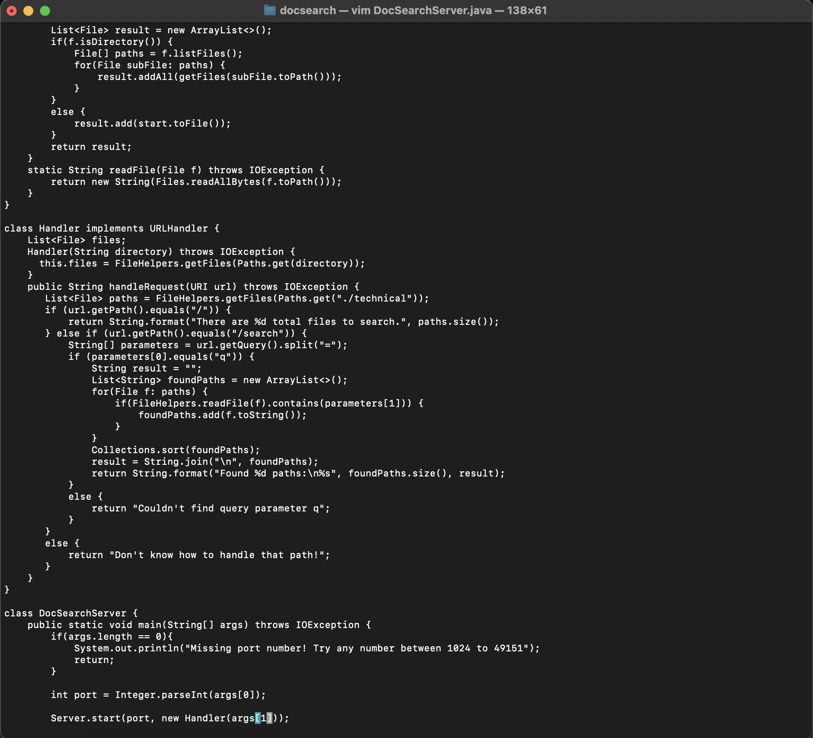

# Lab 4 - Vim

## Table of Contents

## Part 1
I chose to do the third challenge from the lab instructions, which is described as such:

> In DocSearchServer.java, change the main method so that rather than hardcoding the search on the ./technical directory, it uses the second command-line argument for the path to search

Here is the character sequence that I found that worked most efficiently:

```
? ” . / <return> d 2 w x x i a r g s [ 1 ] <esc> : x <return>
```

We'll start off by opening `DocSearchServer.java` using Vim. Doing so produces the following screen, which is the standard Vim interface:



We can then use `? ” . / <return>` to skip to the first occurence of `"./`, which should be in line 74 (`Server.start(port, new Handler("./technical/"));`). Doing this produces the following screen. Notice that the cursor has moved over to the specific line.



Next, we'll use `d 2 w x x` to delete the `"./technical/"` directory from the line. After inputting this character sequence, we obtain this:



Finally, we'll use `i a r g s [ 1 ] <esc>`. The `i` will switch Vim into insertion mode. We can then type in `args[1]` to map the input to the second element in the argument list. We can then use `<esc>` to leave insertion mode. This will produce the following:



We can then exit using `: w <return>`. This will finally produce this message at the bottom of our screen:


## Part 2
I tried to the sequence described above in Visual Studio code and used `scp` to copy the respective file onto the remote server. In total, it took me about 22 seconds. I also tried using `ssh` to log into the remote servers and then used Vim to edit `DocSearchServer.java` directly on the remote server. This took me about 25 seconds. Although Vim was slightly slower, I still believe that Vim is better and more efficient for small quick edits like what we did today. I also think that the Vim route might have been slightly slower because I am less experienced with Vim as opposed to a standard editor like Visual Studio Code. I think in the future, I might use Visual Studio Code for larger edits, but I might use Vim for small quick edits, as it may be more time efficient.