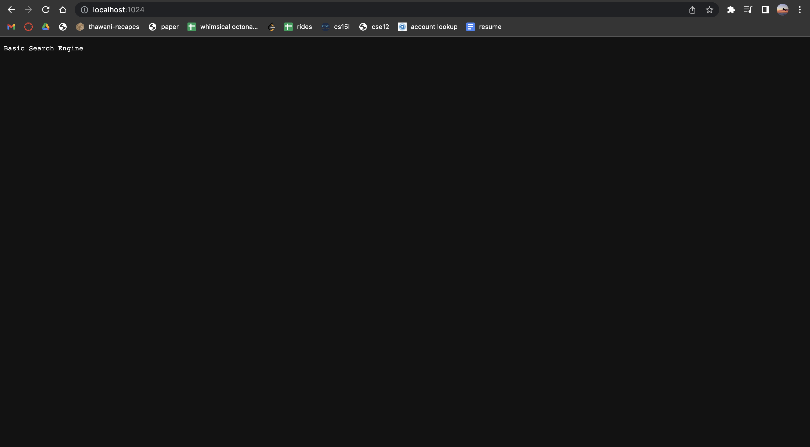
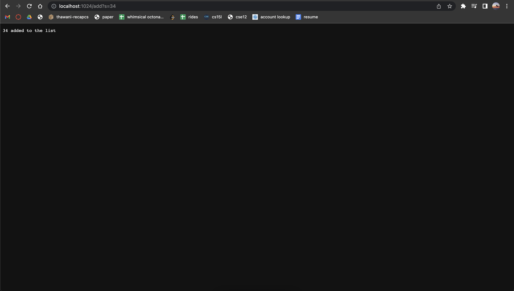
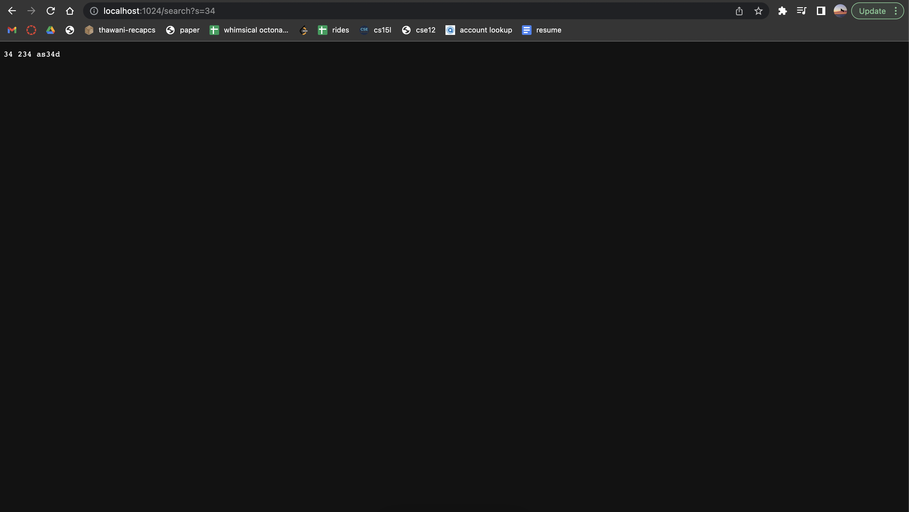

# Week 2 & 3 - Simple Search Engine and Testing

## 1. Simple Search Engine
In Week 2, we implemented an ultra-basic search engine to practice our use of `ssh` and `scp`. Using the structure of the given `Server.java` file, I was able to implement the search engine using the following code:

```java
import java.io.IOException;
import java.net.URI;
import java.util.ArrayList;
import java.util.List;

class Handler implements URLHandler {
    List<String> list = new ArrayList<>();

    public String handleRequest(URI url) {
        if (url.getPath().equals("/")) {
            return String.format("Basic Search Engine");
        }
        else {
            System.out.println("Path: " + url.getPath());
            if (url.getPath().contains("/add")) {
                String[] parameters = url.getQuery().split("=");
                if (parameters[0].equals("s")) {
                    list.add(parameters[1]);
                    return String.format("%s added to the list", parameters[1]);
                }
            }
            if (url.getPath().contains("/search")) {
                String[] parameters = url.getQuery().split("=");
                List<String> ans = new ArrayList<>();
                if (parameters[0].equals("s")) {
                    for (String i: list) {
                        if (i.contains(parameters[1])) {
                            ans.add(i);
                        }
                    }
                }
                return String.join(" ", ans);
            }
            return "404 Not Found!";
        }
    }
}

class SearchEngine {
    public static void main(String[] args) throws IOException {
        if(args.length == 0){
            System.out.println("Missing port number! Try any number between 1024 to 49151");
            return;
        }

        int port = Integer.parseInt(args[0]);

        Server.start(port, new Handler());
    }
}
```

You can run the above class using `javac SearchEngine.java` and `java SearchEngine <port-number>`. (*Note that you must pass in the desired port number as an argument into the command line - this value can be anything between 1024 and 49151*). Once you run the program, the `main` function is called - establishing the web server at the selected port and allowing you to view the live version of your project at `<host>:<port-number>`. Your screen should look somewhat like the one below:



After getting the live version of the program running, you can append various paths to the end of the URL to achieve different results. There are two basic functions that you can use: `/add?s=<element>` and `/search?s=<query>`. They're both detailed below:
- **/add**
    - After appending `/add` to the end of your URL, you can append `?s=` followed by any String value. Doing this will call the `handleRequest` function and will go into the the first `if` condition. This appendage will add your chosen value to the ArrayList, `list`. The function will then print to the screen, confirming that your chosen value has been added to the list. An example for the String value "34" is shown below:

    - 

- **/search** 
    - After adding `/search` to the end of your URL, you can append `?s=` followed by any String value. This will invoke the second `if` condition in `handleRequest` and will search the ArrayList, `list`, for any occurrences of the String value passed in through the query. The function then iterates through `list` and returns a list of the elements from `list` that contain the String value. In the example below, I have added the following values to `list`: `{"34", "25", "24", "234", "as34d"}`. Searching for the value "34" returns the following:

    - 


## 2. Testing
- **ArrayExamples Bugs**
    - Test - The test used to identify this test is detailed below: 
    ```
    @Test
      public void testReverse() {
        int[] a = {3, 1, 5};
        assertArrayEquals(new int[]{5, 1, 3}, ArrayExamples.reversed(a));
      }
    ```
    - Code - The code for the `ArrayExmples.reversed()` function is detailed below:
    ```
    static int[] reversed(int[] arr) {
        int[] newArray = new int[arr.length];
        for(int i = 0; i < arr.length; i += 1) {
          arr[i] = newArray[arr.length - i - 1];
        }
        return arr;
    }
    ```
    - Symptoms - When the above test is run, the `reversed` function runs on array `a`, but returns the array `{0, 0, 0}`, which is the incorrect reversal. The correct reversed array should be `{5, 1, 3}`.
    - Bugs - When the above test is run, the function above is invoked on the array `a`. The `reversed` function then iterates through `arr` (reference to `a`), reassigning each value in `arr` (`a`) to the diametrically opposite index value from `newArray`, an initialized array from within the `reversed` function. This causes each value in `a` to be reassigned to the default values put into `newArray` when `newArray` was initialized, which in our case, is 0.
    - Fixes - This issue could be easily corrected by correcting line 4 of the `reversed` function to be the following: `newArray[i] = arr[arr.length - i - 1];`. Additionally, you would need to change the return statement to be `return newArray;` instead of `return arr;`
- **ListExamples Bugs**